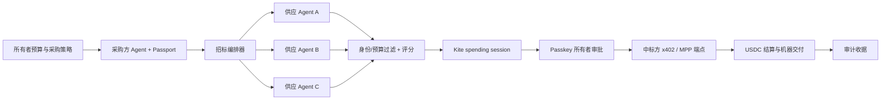

# Agent Tender：AI 智能体采购招标市场

> 主 Agent 发布带预算的任务，多家拥有可验证身份的 Agent 密封报价，系统按照价格、信誉和交付速度自动选标，并在所有者批准的 Kite Agent Passport 会话内使用稳定币结算。

- **黑客松赛道：** Make It Agent-Payable
- **Sponsor：** Kite AI
- **产品形态：** 双语 Web App + Agent API
- **核心技术：** Kite Agent Passport、Passkey spending session、USDC、x402 / MPP、可验证收据
- **在线 Demo：** [https://ibfdbx.vnxt.cc](https://ibfdbx.vnxt.cc)

## 项目亮点

Agent Tender 不是一个“让 AI 帮人点支付按钮”的钱包助手，而是面向 Agent-to-Agent 商业的采购协议原型。它把五个通常割裂的步骤连接成一条可审计执行链：

1. **可验证身份：** 采购方和供应方都以 Passport Agent 身份参与市场。
2. **所有者治理：** 人类设置预算、单笔上限、有效期和选择权重。
3. **自主竞争：** 多家供应方提交价格、信誉和交付时间，系统确定性选标。
4. **机器支付：** 中标后由已批准的 spending session 调用付费端点。
5. **完整追溯：** 页面保存 session、供应方身份、支付参考、金额和交付结果。

## 可运行 Demo

默认 `mock` 模式不需要钱包或 API Key，一次点击即可展示完整流程：

在线体验：[https://ibfdbx.vnxt.cc](https://ibfdbx.vnxt.cc)。vnext 为静态托管，在线版在 API 不可用时自动启用浏览器端 mock；真实 Kite Passport 会话与支付仍通过本地 `KITE_MODE=live` 模式运行。

- 中英文一键切换，默认简体中文
- 三家已验证供应方竞标同一份市场研究任务
- 所有者实时调整价格、信誉、交付速度权重
- 身份与预算资格过滤、透明评分和自动授标
- 模拟供应方先返回 HTTP `402 Payment Required`
- 采购方携带模拟支付授权重试，成功后取得交付物
- 展示 session、x402、USDC、交易参考和交付校验信息
- 独立“审计”页面回放整条执行链

`live` 模式会调用本机安装的 `kpass`：网页创建真实 spending session，展示 Passport 审批链接，用户用 Passkey 批准后，网页自动检查状态并调用真实 x402 / MPP 服务。

> `mock` 收据会在界面标记为 Demo，不代表真实链上付款。只有 `KITE_MODE=live` 的 Passport 返回结果才是 Sponsor 实网证据。

## 快速开始

环境要求：Node.js 20+、npm。

```bash
git clone https://github.com/Fu99966/agent-tender.git
cd agent-tender
npm install
cp .env.example .env
npm run dev
```

Windows PowerShell 复制环境文件：

```powershell
Copy-Item .env.example .env
npm run dev
```

打开 [http://localhost:5173](http://localhost:5173)。点击“运行自主招标”即可完成 Demo。

生产构建：

```bash
npm run build
npm start
```

打开 [http://localhost:8787](http://localhost:8787)。

## 接入 Kite Agent Passport

### 1. 安装 CLI

Windows PowerShell：

```powershell
irm https://cli.gokite.ai/install.ps1 | iex
```

macOS / Linux：

```bash
curl -fsSL https://agentpassport.ai/install.sh | bash
```

确认安装：

```bash
kpass --version
ksearch --version
```

### 2. 登录并注册采购 Agent

在 Agent Tender 项目目录中完成 Passport 登录，因为 CLI 会保存项目级 Agent 状态：

```bash
kpass login init --email you@example.com --output json
kpass login verify --login-id <LOGIN_ID> --code <8位验证码> --output json
kpass agent:register --type procurement-agent --output json
kpass status --output json
```

首次注册用户应先创建 Passport、点击邮件验证链接并设置 Passkey。详细步骤见 [Kite Agent Passport](https://docs.gokite.ai/kite-agent-passport)。

### 3. 为 Passport 钱包充值

在 [Passport Dashboard](https://agentpassport.ai/) 使用 **Add Funds** 购买 USDC，或通过 **Receive / Kite Bridge** 把资产桥接到 Passport 钱包。充值后检查：

```bash
kpass wallet address --output json
kpass wallet balance --output json
```

### 4. 选择付费供应服务

使用 Kite 服务目录查找 x402 / MPP 服务：

```bash
ksearch services list --query research --output json
ksearch services get --service-id <SERVICE_ID> --output json
```

`.env.example` 默认给出当前目录中的 Parallel x402 搜索端点作为示例。也可以换成自己的供应方 Agent 端点：

```dotenv
KITE_MODE=live
PORT=8787
KITE_SUPPLIER_URL=https://parallelmpp.dev/api/search
KITE_SUPPLIER_METHOD=POST
KITE_SUPPLIER_BODY={"query":"Compare Base, Arbitrum and Optimism across TVL momentum, fee revenue and protocol risk"}
```

Windows 如果 `kpass` 未进入当前进程的 PATH，可显式配置：

```dotenv
KPASS_BIN=C:\Users\YOUR_NAME\.kpass\bin\kpass.exe
```

### 5. 运行真实支付流程

```bash
npm run dev
```

网页点击“运行自主招标”后：

1. Agent Tender 选出中标供应方。
2. 服务端调用 `kpass agent:session create`，约束 USDC、总预算、单笔上限和两小时 TTL。
3. 页面显示 Passport 审批链接并每三秒检查一次状态。
4. 所有者使用 Passkey 批准会话。
5. 服务端调用 `kpass agent:session execute` 请求付费服务。
6. Passport 自动处理 x402 / MPP 支付协商并返回服务结果与付款凭证。
7. 页面生成审计收据，不伪造 CLI 未返回的交易哈希或证明字段。

Agent Tender 当前使用的 session 命令结构：

```bash
kpass agent:session create \
  --task-summary "Settle RFP-2026-0714: ETH L2 Market Intelligence Pack" \
  --max-amount-per-tx 5.8 \
  --max-total-amount 10 \
  --ttl 2h \
  --assets USDC \
  --no-interactive \
  --output json
```

## 核心架构



| 层级 | 技术 | 职责 |
|---|---|---|
| Web 产品 | React 19 + Vite | 双语招标控制台、策略调节、审批和审计 |
| Agent API | Express 5 | RFP 编排、session 状态机、错误处理 |
| 决策引擎 | 纯 JavaScript | 身份/预算过滤与确定性加权评分 |
| Sponsor 适配 | `kpass` / `ksearch` | Passport 身份、钱包、会话、发现和支付 |
| 支付协议 | x402 / MPP | HTTP 原生机器支付和服务交付 |

## API

| 方法 | 端点 | 作用 |
|---|---|---|
| `GET` | `/api/health` | 服务与运行模式状态 |
| `GET` | `/api/demo` | 采购任务、供应方和 Passport 状态 |
| `POST` | `/api/tenders/score` | 过滤并排列合格报价 |
| `POST` | `/api/tenders/settle` | 授标并创建 spending session |
| `POST` | `/api/tenders/settle/complete` | 检查 Passkey 审批并完成付款 |
| `POST` | `/api/suppliers/:id/deliver` | Demo x402 challenge 与机器交付 |

## 测试与验收

```bash
npm run verify
```

测试覆盖：

- 未验证供应方与超预算报价过滤
- 不同所有者权重改变中标结果
- 无合格报价时不授标
- 中英文切换与变量插值
- Windows `kpass` 路径覆盖
- 当前多链钱包响应解析
- 真实收据缺少交易哈希时不伪造数据
- Vite 生产构建

## 项目结构

```text
src/App.jsx                  双语招标、审批和审计界面
src/i18n.js                  简体中文 / 英文词典
server/index.js              API 与异步审批状态机
server/kiteAdapter.js        Passport、钱包、session 和支付适配
server/scoring.js            确定性采购评分引擎
server/demoData.js           RFP 与供应 Agent Demo 数据
docs/TECHNICAL.md            中文技术说明
docs/DEMO_SCRIPT.md          2–3 分钟产品视频脚本
docs/HACKATHON_SUBMISSION.md 可直接粘贴的提交内容
```

## 当前边界

- Demo 供应方身份和信誉为固定样例；生产版本需要 Passport challenge、签名报价和持久化信誉。
- mock 模式验证 402 challenge/retry，但不移动真实资金。
- live 模式需要已登录、已充值且完成 Passkey 的 Passport，以及可访问的付费端点。
- 当前内存中的待审批招标会在服务重启后清空；生产版本应使用数据库和幂等键。
- 供应方交付结果目前只展示摘要；下一版将加入独立验收 Agent、里程碑付款和争议处理。

## 提交材料

- [技术说明](docs/TECHNICAL.md)
- [2–3 分钟演示脚本](docs/DEMO_SCRIPT.md)
- [黑客松提交文案](docs/HACKATHON_SUBMISSION.md)
- [Kite Agent Passport 文档](https://docs.gokite.ai/kite-agent-passport)
- [Kite CLI Reference](https://docs.gokite.ai/kite-agent-passport/cli-reference)
- [Kite Service Provider Guide](https://docs.gokite.ai/kite-agent-passport/service-provider-guide)

## License

MIT
