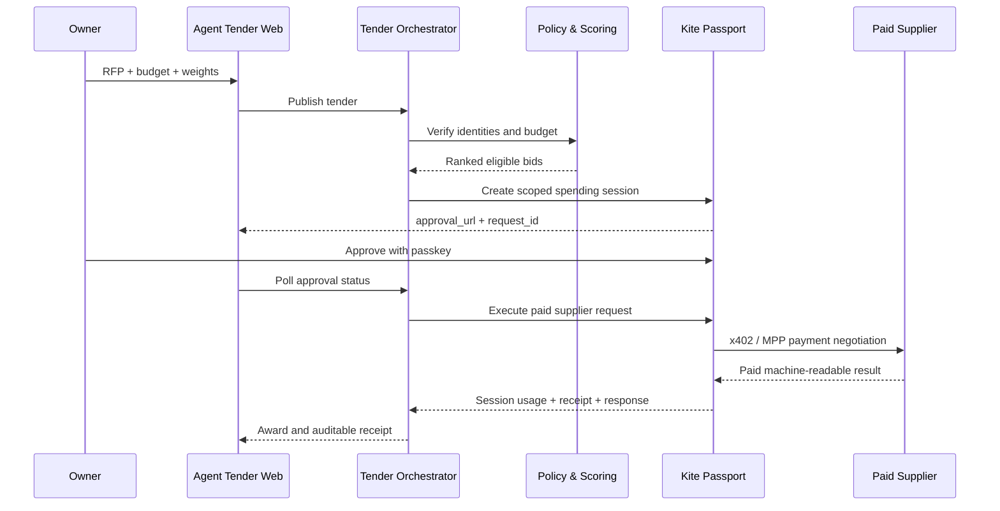

# Agent Tender 技术说明

## 1. 赛道与项目定义

- **赛道：** Make It Agent-Payable
- **Sponsor：** Kite AI
- **项目：** Agent Tender，AI 智能体采购招标市场
- **产品形态：** React Web App + Express Agent API

Agent Tender 解决的核心问题是：当 AI Agent 可以自主购买 API、数据、研究和算力时，如何证明“谁在行动、谁授权、最多能花多少、为什么选择这家供应方、钱最终付给了谁”。

主 Agent 接收所有者给出的 RFP、预算和选择策略；供应 Agent 提交身份、价格、信誉和交付时限；系统先过滤未验证或超预算的报价，再以确定性算法选标；中标后，主 Agent 在所有者批准的 Kite spending session 内调用付费服务并保存收据。

## 2. Sponsor 技术接入

### 2.1 Kite Agent Passport 身份

采购 Agent 通过 `kpass agent:register` 注册，并由 Passport 绑定到当前用户。live 模式从 `kpass status` 读取真实 `agent_id`、Agent 类型和注册状态；未注册 Agent 无法创建支付会话。

MVP 中三家供应 Agent 使用结构化 Demo 身份，以便稳定演示竞标。生产版本会要求供应方完成 Passport challenge，并对 `RFP ID + 报价 + 过期时间 + nonce` 签名。

### 2.2 所有者授权 spending session

授标后，服务端创建与采购任务绑定的会话：

```bash
kpass agent:session create \
  --task-summary "Settle RFP-2026-0714: ETH L2 Market Intelligence Pack" \
  --max-amount-per-tx 5.8 \
  --max-total-amount 10 \
  --ttl 2h \
  --assets USDC \
  --no-interactive \
  --output json
```

会话创建不会直接支出。Passport 返回 `request_id` 和 `approval_url`，Web App 将链接显示给所有者，并每三秒调用状态接口。所有者在 Passport 页面核对任务、单笔上限、总预算、资产和有效期，然后用 Passkey 批准。批准后 Agent 只能在这些边界内自主行动。

### 2.3 `ksearch` 服务发现

Agent Tender 可以通过 `ksearch services list/get` 发现支持机器支付的服务。当前服务目录同时包含 x402 与 MPP 服务；示例配置使用 Parallel 的 x402 搜索端点，真实部署也可以换成团队自己的供应 Agent 服务。

服务发现得到的方法、路径、支付协议、资产和起步价格后，系统把它们转化为供应方能力和报价数据。后续版本会让供应方列表完全动态化。

### 2.4 x402 / MPP 付费执行

所有者批准后，后端调用：

```bash
kpass agent:session execute \
  --url "$KITE_SUPPLIER_URL" \
  --method POST \
  --headers '{"Content-Type":"application/json"}' \
  --body "$KITE_SUPPLIER_BODY" \
  --no-interactive \
  --output json
```

Passport 负责协议协商与付款：

1. Agent 请求供应方服务。
2. x402 服务返回 HTTP 402 支付条款，或 MPP 服务返回协议要求。
3. Passport 检查当前 session 的资产、单笔上限、总预算和有效期。
4. Passport 生成支付授权并完成结算。
5. 供应方返回机器可读交付结果。
6. Adapter 把 session、付款要求、响应和实际返回的结算参考归一化为审计收据。

系统不会伪造 CLI 未返回的交易哈希、Proof ID 或链上引用。若供应方只返回 receipt ID，界面展示 receipt ID，而不是构造假的 KiteScan 链接。

### 2.5 钱包与资金

live 模式并行读取：

```bash
kpass wallet address --output json
kpass wallet balance --output json
```

Adapter 支持当前 Base、Tempo、Solana 多链钱包响应，并汇总 USDC 总余额。充值在 Passport Dashboard 中通过 Add Funds 或 Kite Bridge 完成。

## 3. 核心架构



### 组件职责

| 组件 | 文件 | 职责 |
|---|---|---|
| 双语控制台 | `src/App.jsx` | RFP、竞标、权重、审批、结算和审计 |
| 国际化词典 | `src/i18n.js` | 简体中文和英文文案、变量插值 |
| 招标 API | `server/index.js` | 流程编排、待审批状态和 HTTP 错误边界 |
| 策略引擎 | `server/scoring.js` | 身份/预算过滤与透明评分 |
| Kite Adapter | `server/kiteAdapter.js` | CLI 路径、JSON 解析、钱包、session、付款和收据 |
| Demo 服务 | `server/index.js` | 可重复的 HTTP 402 challenge/retry |

## 4. 评分算法

所有者设置价格、信誉和速度权重。系统先把权重归一化，再对合格供应方计算：

```text
总分 = 价格效率分 × priceWeight
     + 信誉分 × reputationWeight
     + 交付速度分 × speedWeight
```

只有同时满足以下条件的报价才参与排序：

- `verified === true`
- `price > 0`
- `price <= approvedBudget`

评分是确定性的：相同输入总会产生相同结果，便于审计、复盘和争议处理。模型可以帮助理解采购需求，但不能绕过硬性预算与身份门槛。

## 5. 关键功能

### 5.1 多 Agent 密封竞价

三家供应 Agent 同时提交报价。界面在评分前不显示“中标”状态，完成过滤与排序后才公开结果，展示最低价不一定等于最佳综合选择。

### 5.2 策略可解释

所有者可以现场调整三个权重。页面显示每个供应方的价格、交付时间、信誉和最终分数，让 Agent 的授标决定可以解释和复现。

### 5.3 人在策略环内，而非每笔操作环内

所有者只批准一次受限 session；批准后 Agent 可以在预算、资产和 TTL 内完成服务调用。需要更大预算或不同资产时，必须创建新的审批请求。

### 5.4 异步 Passkey 审批

后端不会在不可见状态中长时间阻塞。它立即把 `approval_url` 返回给网页；网页展示操作入口并自动轮询。拒绝、过期和超时都不会调用供应服务。

### 5.5 双层 Demo 策略

- **mock：** 无凭据、一键运行；真实执行 HTTP 402 challenge/retry，但支付授权与交易参考为明确标注的模拟数据。
- **live：** 调用真实 `kpass`，展示 Agent 身份、钱包、Passkey 会话和付费服务结果。

这保证了评审现场的稳定性，同时避免把模拟能力描述成 Sponsor 实网能力。

## 6. 安全与错误处理

- CLI 使用参数数组启动，不经过 shell 拼接，降低命令注入风险。
- Windows 优先使用官方安装目录中的 `kpass.exe`，也允许通过 `KPASS_BIN` 显式配置。
- `--output json` 与 `--no-interactive` 保证 Agent 可结构化处理结果。
- CLI 非零退出码或 `status: error` 会转成受控 API 错误。
- 未验证身份、非法价格和超预算报价在创建 session 前被拒绝。
- 未获批准的 session 只返回 `202 pending`，绝不调用付费端点。
- 付款成功以 Passport execute 响应、session usage 和结算 receipt 为准，不用可能缓存的钱包余额代替支付证据。
- live 收据只保留真实返回字段；缺失交易哈希时不生成探索器链接。
- 待审批 RFP 当前保存在内存中；服务重启后自动失效，避免错误续付。

## 7. 测试与验收

运行：

```bash
npm run verify
```

自动化测试覆盖 9 个用例：

- 供应方身份与预算过滤
- 策略权重改变中标者
- 无合格报价时不授标
- 中英文文案和变量插值
- 自定义 CLI 路径
- 当前多链钱包 JSON 解析
- receipt 有无交易哈希时的真实语义
- 前端生产构建

此外，提交前应进行以下人工验收：

1. 桌面端与移动端无文本重叠或横向溢出。
2. 中文 / English 切换覆盖导航、状态、日志和收据。
3. mock 流程从 RFP 到审计收据完整可重复。
4. live 流程能显示 Passport 审批链接，批准后再付款。
5. Dashboard 或 `kpass activity` 能找到对应真实付款记录。

## 8. 当前边界

- 供应方 Passport challenge 和签名报价尚未实现。
- 供应信誉仍为 Demo 数据，不来自历史付款与交付记录。
- 供应方交付物尚未经过独立验证 Agent 的质量验收。
- 待审批任务和幂等状态使用内存存储。
- Demo 服务不会真实广播交易；真实支付只发生在 live 模式。

## 9. 后续迭代计划

### Phase 1：开放供应市场

- 基于 `ksearch` 动态导入服务能力、协议、价格和端点
- Passport DID challenge 与签名密封报价
- PostgreSQL 持久化 RFP、报价、session 和收据
- 每个请求的幂等键与防重放 nonce

### Phase 2：交付验收与里程碑支付

- 独立验证 Agent 按测试或质量标准验收结果
- 预付款、里程碑付款和多人分账
- 交付失败退款、惩罚与争议仲裁
- 基于真实支付和交付记录更新信誉

### Phase 3：隐私与链上协议

- 加密密封报价与零知识比较
- 链上 Tender / Award / Receipt 索引
- DAO 多签、企业多角色审批和部门额度
- 跨链路由成本上限与结算策略

### Phase 4：开发者生态

- TypeScript SDK 与 MCP Server
- LangGraph、ElizaOS、OpenAI Agents SDK 适配器
- API、数据、算力、旅行和创意服务的行业模板

## 10. Sponsor 价值总结

Kite Agent Passport 不是附加在 Demo 尾部的付款按钮，而是 Agent Tender 的信任根：

- Passport 证明谁是采购 Agent。
- Passkey 证明所有者批准了什么预算与时限。
- spending session 把人类意图转成机器可执行边界。
- x402 / MPP 让 Agent 可以直接购买服务。
- receipt 把付款关联回 session、Agent 和用户。

Agent Tender 因此展示了一个完整的 Agent 经济闭环：**身份 → 授权 → 竞争 → 支付 → 交付 → 审计**。
